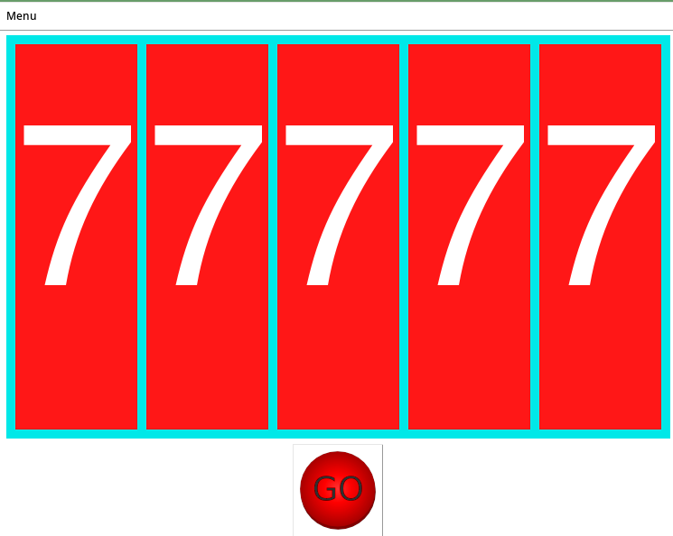
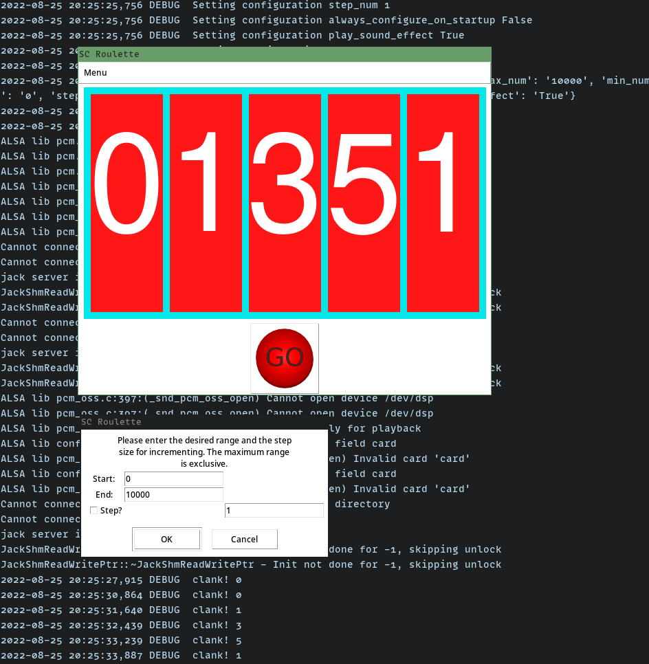

# suspenseful_random_number_picker

Suspensful random number picker created for the New Mexico Supercomputing Challenge's kickoff roulette.

## Running

This program only uses the Python standard library.
No external dependencies are necessary, besides a Python installation.

If you install the `pyaudio` Python library, this program can play sound.

Try any of:

```
./SCC_roulette.py
```

```
python3 ./SCC_roulette.py
```

```
python2 ./SCC_roulette.py
```

### Features

- Press space, enter, or click the button to pick a random number
- All options configurable through the dropdown menu 
- Configuration is saved to a file
- Optional sound effect





## Developing

Run `make commitready` to format and lint the code.

Use `make setup-with-pipenv` to setup development dependencies or install the dependencies in ./development_requirements.txt in your own way.

Try to use the Python version specified in the .tool-versions file.

<!-- TODO we may use tox to test on many other Python versions -->

## License

The license for this project is in the LICENSE file.

## Credits

`"tada"` sound comes from: https://freesound.org/people/nolhananas/sounds/476340/
